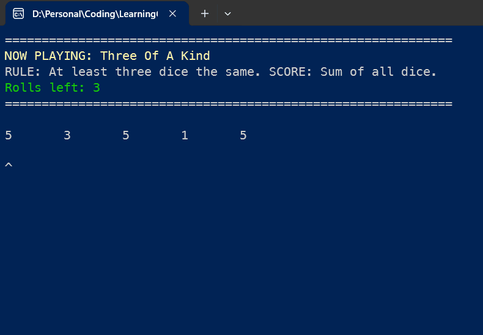

## Yahtzee-Blackjack Hybrid Game

This project is an adaptation of the classic dice game, Yahtzee, with a twist of Blackjack. The goal of the game is to achieve a certain score, similar to reaching 21 in Blackjack, but with the scoring rules of Yahtzee.
Currently, the game only supports the "Three of a Kind" category from Yahtzee, but more categories will be added in future updates.

How to Play
1.	Roll your dice.
2.	Choose which dice to keep based on the category's scoring rules.
3.	Continue rolling until you've used up all your rolls or you choose to stop.
4.	Score your roll according to the category's rules.
5.	The goal is to get as close to the target score as possible without going over.

Future Updates
•	Implementation of more Yahtzee categories.
•	Graphical user interface.
